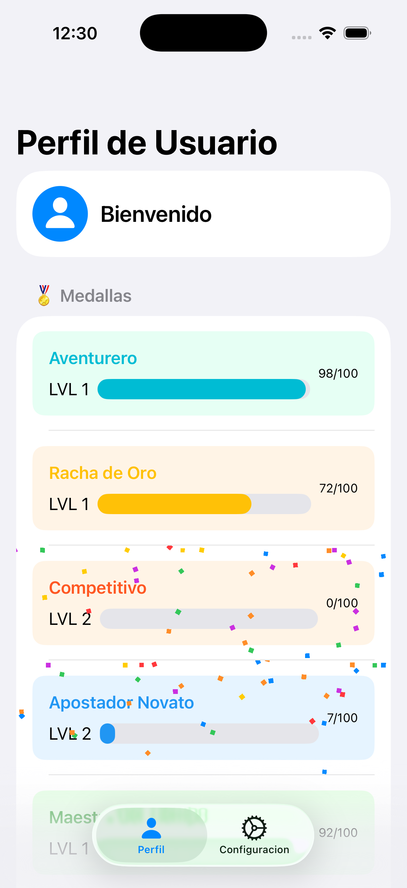

# Building a SwiftUI app MedalsApp

- Para poder correr la aplicacion no es necesario ningun usuario
- El Manager de sesion esta hecho para siempre mostrar la pantalla de Home con la lista de medallas
- Swift Data usada para la persistencia
- Video: https://youtu.be/fiA4U23_HQ4

## El proyecto fue construido con lo siguiente

- iOS 26+
- SwiftUI con la característica ObservableObject para mejor rendimiento
- MVVM con capa de persistencia
- Pruebas con Swift Testing

## Características del Proyecto

- Patrón Coordinator (Coordinador)
- Pantalla de Inicio (obtiene datos desde Persistence Swift Data, muestra lista de medallas)
- Pantalla de Configuración (muestra opciones de apariencia, capacidades de cierre de sesión)
- Lista de Medallas (persistencia local)
- Pruebas, Mocks e Inyección de Dependencias
- Flujo de Login solo para mostrar comportamiento del Coordinator
  
## Screenshots

